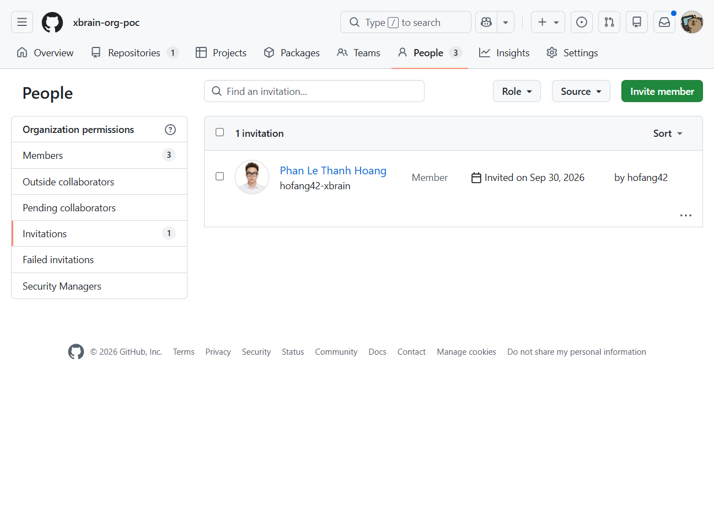
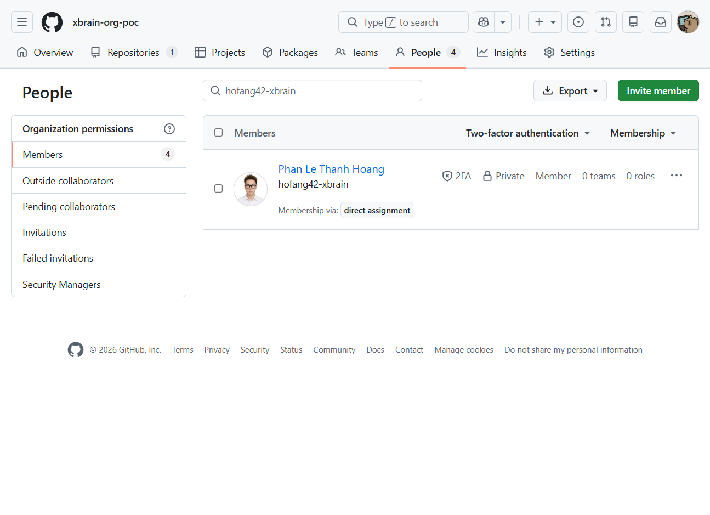
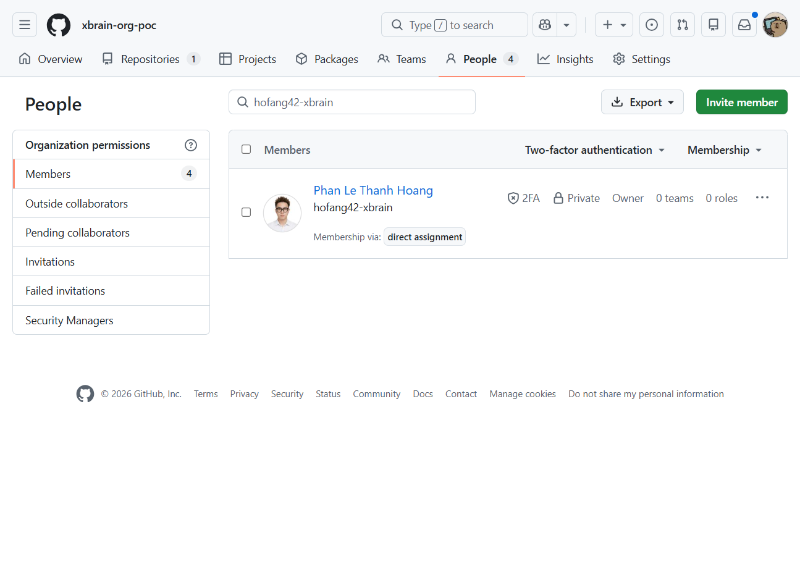
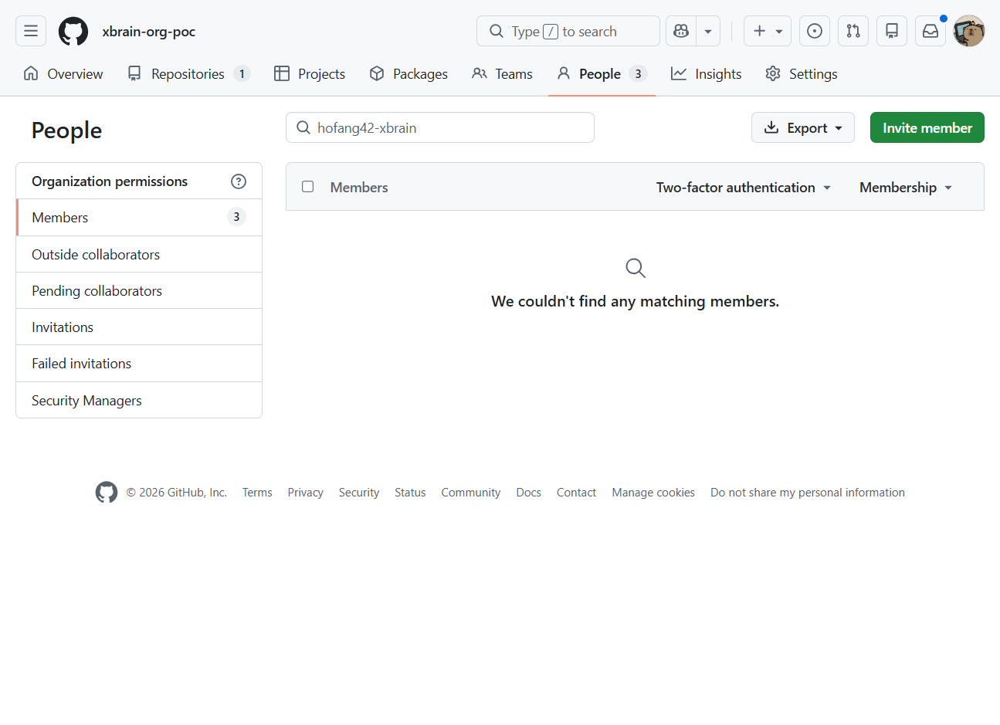
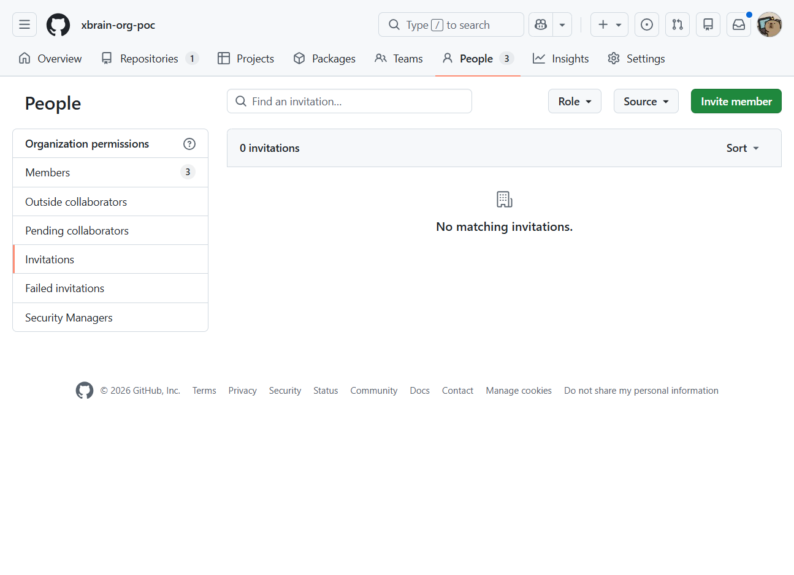

# PoC evidence: GitHub Organization Members

**Kết luận: PASS trên GitHub.com thật.** Org `xbrain-org-poc`; target `hofang42-xbrain`; actor `hofang42` là owner. Terraform 1.16.3, `integrations/github` 6.13.0. Chạy từ local Ubuntu/WSL. State cuối đã dọn sạch.

| Thao tác | Kết quả quan sát | Ảnh GitHub UI |
|---|---|---|
| Invite / pending | Plan `1 add`; Apply `1 added`; API trả `pending/member`, invitation `80418757`. Plan kế tiếp exit 0 dù user chưa accept. |  |
| Cancel / re-invite | Xóa resource hủy pending, API absent, state sạch. Mời lại thành công với invitation `80418899`. | (Log/API gốc bên dưới) |
| Accept | API xác nhận `active/member`; invitation list trống. Người dùng accept thủ công. |  |
| Đổi role | Apply `member → admin (owner) → member`; resource ID không đổi; API xác nhận cả hai role. |  ·  |
| Role drift | Đổi role ngoài Terraform bằng API. Normal plan phát hiện; refresh-only ghi role hiện tại vào state mà không sửa GitHub. Normal apply hội tụ về role trong HCL. | (Log/API gốc bên dưới) |
| State/import | `state rm` không xóa membership; plan đề xuất create; import `xbrain-org-poc:hofang42-xbrain`; plan sau import sạch. | (State/log gốc bên dưới) |
| Remove drift | Xóa qua API ngoài Terraform: API absent. Terraform plan/apply tạo lại lời mời pending; invitation list có mục mới. | (Log/API gốc bên dưới) |
| Remove active | Sau accept lần hai, Terraform plan `1 destroy`; Apply `1 destroyed`. API trả absent (404, list thành viên/invitation thành công), state list rỗng, plan cuối exit 0. |  ·  |

## Log gốc để đối chiếu

Các file này nằm ở `evidence/` trong repo. Tên thư mục bắt đầu bằng UTC timestamp.

| Chủ đề | File gốc |
|---|---|
| Invite/apply/pending/no-op plan | [`invite-plan.txt`](logs/invite-plan.txt), [`invite-apply.txt`](logs/invite-apply.txt), [`invite-api.json`](logs/invite-api.json), [`pending-noop-plan.txt`](logs/pending-noop-plan.txt) |
| Cancel pending / re-invite | [`cancel-pending-apply.txt`](logs/cancel-pending-apply.txt), [`cancel-pending-api.json`](logs/cancel-pending-api.json), [`reinvite-pending-api.json`](logs/reinvite-pending-api.json) |
| Accept, promote/demote | [`active-api.json`](logs/active-api.json), [`promote-owner-apply.txt`](logs/promote-owner-apply.txt), [`demote-member-apply.txt`](logs/demote-member-apply.txt) |
| Role drift / refresh-only | [`role-drift-plan.txt`](logs/role-drift-plan.txt), [`refresh-only-api.json`](logs/refresh-only-api.json), [`refresh-only-state.txt`](logs/refresh-only-state.txt) |
| State rm/import | [`state-rm.txt`](logs/state-rm.txt), [`state-import.txt`](logs/state-import.txt), [`import-converged-plan.txt`](logs/import-converged-plan.txt) |
| External removal drift | [`external-removal-api.json`](logs/external-removal-api.json), [`reinvite-pending-api.json`](logs/reinvite-pending-api.json) |
| Remove active / final cleanup | [`remove-active-apply.txt`](logs/remove-active-apply.txt), [`remove-active-api.json`](logs/remove-active-api.json), [`final-state-list.txt`](logs/final-state-list.txt), [`final-plan-exit.json`](logs/final-plan-exit.json) |
| UI source metadata | `screenshots/*.png` are actual GitHub UI captures. Capture URL/time is recorded beside each original under local `evidence/github-ui/*.json`; GitHub ID is visible in the page itself. |

## Authentication and limits

Fine-grained PAT: resource owner is the org; `Members: read/write`; token owner is an org owner. PAT actor's access and org policy (approval/SSO) still apply. The tested PAT successfully read, invited, changed role, and removed; the run does not establish the minimal scope experimentally. GitHub REST API specifies Members write for mutations and read for membership/invitation verification: [membership endpoints](https://docs.github.com/en/rest/orgs/members). Provider behavior/source: [`github_membership` v6.13.0](https://github.com/integrations/terraform-provider-github/blob/v6.13.0/docs/resources/membership.md).

`github_membership` stores username/role, not invitation acceptance state. The invite recipient must accept. This run did not test invitation expiration, GitHub App, GHES, SCIM/EMU, or indirect enterprise team access. `admin` means owner. Direct membership removal may not revoke indirect enterprise team access. State and screenshots include organization/user information; `.env`, tfvars, state, saved binary plans, browser profile, and share ZIP are excluded from Git.
